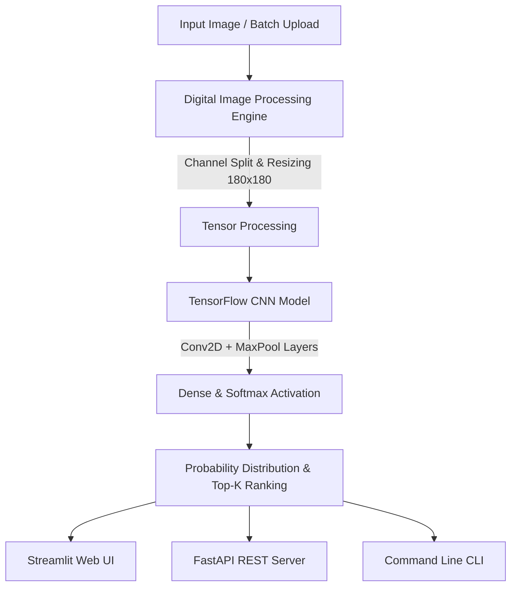

# FloraVision: TensorFlow Flower Classifier & Digital Image Processing Suite

[](https://www.python.org/)
[](https://www.tensorflow.org/)
[](https://streamlit.io/)
[](https://fastapi.tiangolo.com/)
[](https://www.docker.com/)
[](LICENSE)

An enterprise-grade **Computer Vision & Digital Image Processing (DIP)** application built on top of a 3-layer Convolutional Neural Network (CNN). The system offers multi-interface accessibility including an interactive **Streamlit Web Dashboard**, a production-ready **FastAPI REST API**, a **Command-Line Interface (CLI)**, and containerized deployment configurations.

---

## 🌟 Key Features

- **🌸 Multi-Class Flower Recognition**: Classifies flower species into 5 distinct categories (*Daisy*, *Dandelion*, *Roses*, *Sunflowers*, *Tulips*) with Softmax probability distributions.
- **🔬 Digital Image Processing (DIP) Studio**: Performs RGB channel decomposition, grayscale luminance conversion, spatial gradient edge detection, and statistical image profiling.
- **💻 Interactive Web Dashboard**: Dark-mode Streamlit UI featuring top-K probability breakdown bars, interactive DIP labs, and botanical metadata.
- **⚡ Production REST API**: FastAPI backend with OpenAPI (Swagger) documentation, health check endpoints, and single/batch inference endpoints.
- **🛠️ Command-Line Interface (CLI)**: Lightweight command-line utility for single image and folder-level batch processing with JSON export options.
- **🐳 Docker & Orchestration**: Containerized setup via `Dockerfile` and `docker-compose.yml` for cloud deployment (AWS ECS, GCP Cloud Run).
- **🧪 Unit & Integration Test Suite**: Robust `pytest` coverage for image transformation pipelines, model predictions, and API controllers.

---

## 🏗️ System Architecture



---

## 📊 Model Specifications

| Parameter | Value / Detail |
| :--- | :--- |
| **Model Type** | Sequential Convolutional Neural Network (CNN) |
| **Input Shape** | `(180, 180, 3)` RGB Tensor |
| **Preprocessing** | Data Augmentation & `1/255` Rescaling Layer |
| **Feature Extraction** | 3 x `Conv2D` (16, 32, 64 filters) + `MaxPooling2D` |
| **Regularization** | `Dropout (0.2)` Layer |
| **Classification Head** | Dense (128 units, ReLU) -> Dense (5 units, Softmax) |
| **Total Parameters** | **7,978,572** (~30.4 MB) |

---

## 📁 Project Structure

```
tf-flower-classifier/
├── app.py                   # Streamlit Web UI Application
├── api.py                   # FastAPI REST API Backend
├── cli.py                   # Command Line Interface Tool
├── flower_model.keras       # Trained TensorFlow/Keras Weights Model
├── requirements.txt         # Project Dependencies
├── Dockerfile               # Container Image Build File
├── docker-compose.yml       # Container Orchestration
├── .github/
│   └── workflows/
│       └── ci.yml           # GitHub Actions CI Workflow
├── src/                     # Core Source Package
│   ├── __init__.py
│   ├── config.py            # System Configurations & Class Metadata
│   ├── classifier.py        # FlowerClassifier Inference Engine
│   └── image_processor.py   # DIP Transforms & Image Utilities
└── tests/                   # Automated PyTest Suite
    ├── __init__.py
    ├── test_classifier.py   # Classifier Unit Tests
    ├── test_image_processor.py # DIP Unit Tests
    └── test_api.py          # FastAPI Integration Tests
```

---

## 🚀 Quick Start Guide

### 1. Prerequisites & Installation

Clone the repository and set up a Python virtual environment:

```bash
# Clone Repository
git clone https://github.com/your-username/tf-flower-classifier.git
cd tf-flower-classifier

# Create & Activate Virtual Environment
python -m venv venv
# On Windows:
venv\Scripts\activate
# On Linux/macOS:
source venv/bin/activate

# Install Dependencies
pip install -r requirements.txt
```

---

### 2. Launch Interactive Web App (Streamlit)

Run the dashboard locally:

```bash
streamlit run app.py
```
Open `http://localhost:8501` in your web browser.

---

### 3. Launch REST API Server (FastAPI)

Start the production API server:

```bash
uvicorn api:app --reload --port 8000
```
- Interactive Swagger API Docs: `http://localhost:8000/docs`
- ReDoc Documentation: `http://localhost:8000/redoc`

#### Example API Request (cURL):

```bash
curl -X POST "http://localhost:8000/predict" \
     -H "accept: application/json" \
     -H "Content-Type: multipart/form-bytes" \
     -F "file=@sample_flower.jpg"
```

---

### 4. Command Line Tool (CLI Usage)

Classify a single image:
```bash
python cli.py --image path/to/rose.jpg --top-k 3
```

Process an entire directory of images and export JSON:
```bash
python cli.py --dir path/to/flower_folder --json --output results.json
```

---

### 5. Docker Deployment

Build and run using Docker Compose:

```bash
docker-compose up --build
```
- Streamlit Web Dashboard: `http://localhost:8501`
- FastAPI REST Service: `http://localhost:8000`

---

### 6. Running Unit Tests

Execute the automated pytest suite:

```bash
pytest tests/ -v
```

---

## 💼 Highlights

- **Deep Learning Pipeline Development**: Engineered an end-to-end computer vision pipeline using TensorFlow/Keras to perform 5-class flower classification with ~8.0M parameters.
- **Digital Image Processing Integration**: Developed custom preprocessing and feature extraction modules for spatial gradient edge detection, color channel isolation, and tensor transformations.
- **Multi-Tenant System Design**: Designed a modular architecture delivering model inference across Streamlit web applications, FastAPI microservices, and command-line interfaces.
- **MLOps Best Practices**: Implemented containerization (`Docker`), automated testing suites (`PyTest`), and continuous integration workflows (`GitHub Actions`).
